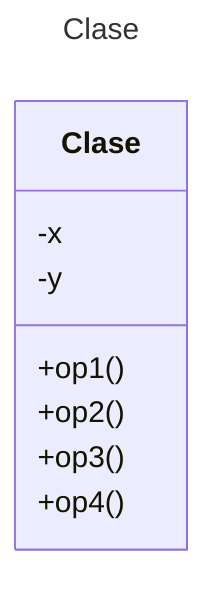

# Proyecto - Template Method

Extienda el diseño de su controlador automotriz del ejercicio del adaptador para que ahora se incluya una nueva operación en todos los motores: **diagnosticar()** para todos los motores (**Común, Económico, Eléctrico e Hibrido**) en el cual se implemente la forma de diagnóstico para cada uno de los motores. Se desea que sea un diagnóstico automático por computadora.

# Casos de Prueba:

•	Están incluidos en su repositorio inicial de Github. Analice la especificación de casos de prueba que el Ingeniero de Pruebas ha diseñado para asegurar la correcta implementación de estos requisitos y programe lo necesario para pasar todas las pruebas. La especificación de prueba se ha realizado de acuerdo al Manual de operación de cada motor donde señala la forma correcta en que el diagnóstico se realiza dependiendo del tipo de motor.

# Diagrama de clases
[Editor en línea](https://mermaid.live/)

[Referencia-Mermaid](https://mermaid.js.org/syntax/classDiagram.html)

# Uso del proyecto con make

## Default - Compilar+Probar+Ejecutar
```
make
```
## Compilar
```
make compile
```
## Probar todo
```
make test
```
## Ejecutar App
```
make run
```
## Limpiar binarios
```
make clean
```
# Comandos Git-Cambios y envío a Autograding

## Por cada cambio importante que haga, actualice su historia usando los comandos:
```
git add .
git commit -m "Descripción del cambio"
```
## Envíe sus actualizaciones a GitHub para Autograding con el comando:
```
git push origin main
```
# Comandos individuales
## Compilar

```
find ./ -type f -name "*.java" > compfiles.txt
javac -d build -cp lib/junit-platform-console-standalone-1.5.2.jar @compfiles.txt
```
Ejecutar ambos comandos en 1 sólo paso:

```
find ./ -type f -name "*.java" > compfiles.txt ; javac -d build -cp lib/junit-platform-console-standalone-1.5.2.jar @compfiles.txt
```


## Ejecutar Todas la pruebas locales de 1 Test Case

```
java -jar lib/junit-platform-console-standalone-1.5.2.jar -class-path build --select-class miTest.AppTest
```
## Ejecutar 1 prueba local de 1 Test Case

```
java -jar lib/junit-platform-console-standalone-1.5.2.jar -class-path build --select-method miTest.AppTest#appHasAGreeting
```
## Ejecutar App
```
java -cp build miPrincipal.Principal
```
Los comandos anteriores están considerados para un ambiente Linux. [Referencia.](https://www.baeldung.com/junit-run-from-command-line)
